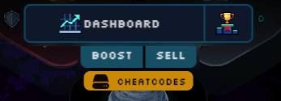

# primodium-empires v0.1.10

Implements v0.1.10 of Primodium: Empires


## Setup

1. Install dependencies:
  ```sh
  pnpm i
  ```
1. Build the project:
  ```sh
  pnpm build
  ```
1. Setup `.env` file and manually fill out the environment variables:
  ```sh
  cp .env.example .env
  ```

## Deploy

### Dev
```sh
pnpm dev
```

Client available at http://localhost:3000, or http://localhost:3000/game?showCheatcodes=true to see cheatcodes. In production, only namespace admins can use cheatcodes.

### Caldera Sepolia
[todo: add instructions]
Before deploying, set the `FIRST_MATCH_START_BLOCK` in the `.env` file to a desired block number in the future.

## Start

### Game States
There are a few different game states to be aware of:

1. `Ready`: The game has been successfully deployed and is ready to be started. Admins can `pause()` the game via the client cheatcodes, which sets the `Ready` table to `false`.
2. `gameStartBlock`: The block at which the game will start. Admins can set this via the client cheatcodes, which calls `setGameConfigAndTurn()`. Viewable in the `P_GameConfig` table.
3. `WinningEmpire`: The empire that has won the game. Whenever this is set as `EEmpire.NULL`, the winner has not been decided yet. Resets to `EEmpire.NULL` when `resetGame()` is called. Viewable in the `WinningEmpire` table.
4. `gameOverBlock`: The block at which the game will end due to time running out. Admins can set this via the client cheatcodes, which calls `setGameConfigAndTurn()`. Viewable in the `P_GameConfig` table.


### First Match Start

Although the world may be deployed, ready, and the game start block is reached, the turns will not progress until the Keeper is started.
(Players could still purchase overrides if other conditions above were met and the Keeper is not started.)

On the cheatcodes client, select the cheatcodes button.



If you'd like to adjust the game start block, you can do so by clicking on the `Game Config` cheatcode and changing the appropriate value. [todo: implement this in client]

Start the Keeper with the following procedure: [todo: add instructions]

### Reset Game

Once the game has finished and you would like to reset it for a new match, you can do so with the `Reset Game` cheatcode.
Make sure to set an appropriate `gameStartBlock` when calling this cheatcode. [todo: implement this in client]